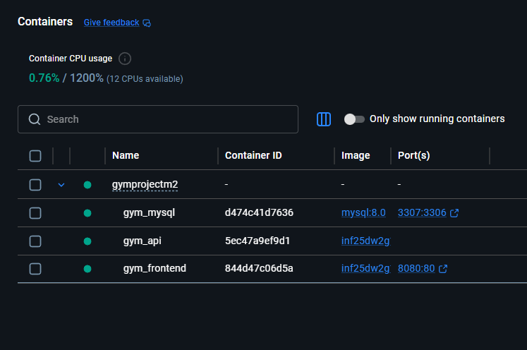
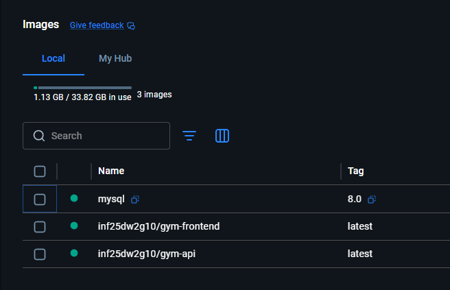
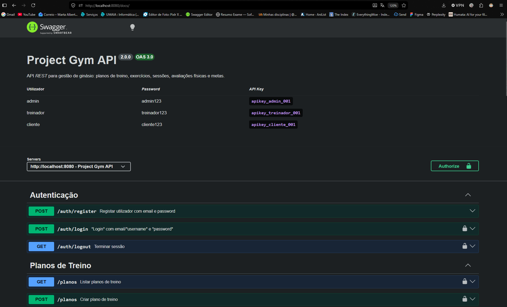
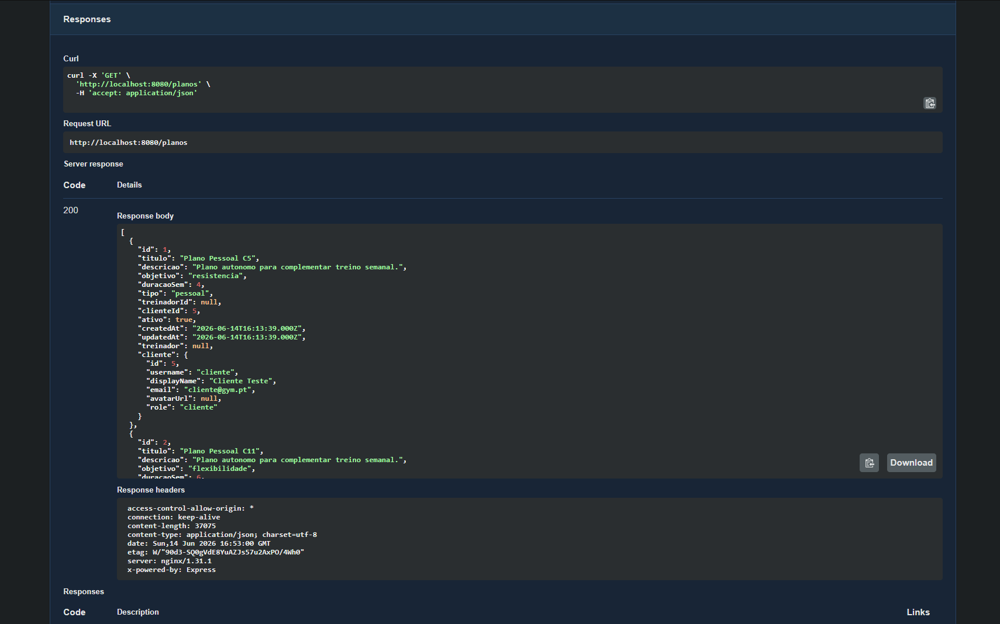

# ProjectGymDashboard - Frontend React + API

Aplicação Web Cliente em **ReactJS** para a **GymAPI** (REST), com autenticação e autorização por roles.

Desenvolvido pelo **Grupo 10 - inf26dw2g10**

- [Marta Vieira](https://github.com/xmarta19) - a046756@umaia.pt
- [Felipe Castilho](https://github.com/a047152) - a047152@umaia.pt
- [Juliana Moreira](https://github.com/julianaam13) - a047188@umaia.pt

Organização **GitHub**: [inf25dw2g10/ProjectGymDashboard](https://github.com/inf25dw2g10/ProjectGymDashboard)  
Repositório **DockerHub**: [inf25dw2g10](https://hub.docker.com/repositories/inf25dw2g10)

---

## Descrição

Este trabalho consiste no  desenvolvimento do **frontend React** da plataforma de gestão de ginásio. Permite que **admin**, **treinadores** e **clientes** consultem e gerem recursos consoante a sua role:

- Planos de treino, exercícios, sessões, avaliações físicas e metas
- Gestão de utilizadores *(apenas admin)*

O browser comunica com a **GymAPI** (REST) através de pedidos HTTP autenticados (`X-API-Key`), após login por **Basic Auth** ou **OAuth 2.0** (GitHub / Google).

**Autenticação**

- **Basic Auth** - `POST /auth/login` com username/email + password → devolve `apiKey` e `role`
- **X-API-Key** - header enviado em todos os pedidos à API
- **OAuth 2.0** - redirect para `/auth/github` ou `/auth/google` → callback no frontend

**Regras de autorização**

- **Admin** - opera em todos os recursos (reutiliza as páginas do treinador no dashboard)
- **Treinador** - atua sobre clientes e recursos do seu âmbito
- **Cliente** - atua apenas sobre os próprios recursos; planos profissionais são só leitura (com excepções por recurso)

---

## Instalação

### Pré-requisitos

- Docker e Docker Compose instalados
- Portas **8080** e **3307** disponíveis

Na raiz do projecto:

```bash
cp .env.example .env
```

Editar `.env` com credenciais OAuth se quiseres usar GitHub/Google.

### Produção

Recomendado para entrega e apresentação.

```bash
docker compose -f docker-compose.prod.yml up --build
# ou: docker compose up --build
```

Abre **http://localhost:8080**

### Desenvolvimento

Hot reload no React + nodemon na API.

```bash
docker compose -f docker-compose.dev.yml up --build
```

| Serviço | URL |
|---------|-----|
| Frontend | http://localhost:8080 |
| SwaggerUI | http://localhost:8080/docs |
| MySQL | localhost:3307 |

**OAuth (GitHub/Google):**   
Os callbacks devem apontar para `http://localhost:8080/auth/github/callback` e  `http://localhost:8080/auth/google/callback` respetivamente.


---

## Login

| Role | Username | Password |
|------|----------|----------|
| Admin | `admin` | `admin123` |
| Treinador | `treinador` | `treinador123` |
| Cliente | `cliente` | `cliente123` |


---

## Stack

| Camada | Tecnologia |
|--------|------------|
| Frontend | React 18 + Create React App (`react-scripts`) |
| Routing | React Router v5 |
| HTTP | Axios |
| API | Node.js + Express + MySQL *(pasta `api/`)* |
| Docker prod | nginx (build estático) + API + MySQL |
| Docker dev | CRA dev server + nodemon + MySQL |

Documentação técnica da API (OpenAPI, Postman, Sequelize): ver [`api/README.md`](../api/README.md).

---

## Organização do repositório

| Pasta / ficheiro | Conteúdo |
|------------------|----------|
| [`src/`](../src/) | Código fonte React (páginas, componentes, rotas) |
| [`doc/`](.) | Relatório (capítulos C1-C4) e imagens |
| [`api/`](../api/) | GymAPI - Express, modelos, migrations, seeders |
| [`public/`](../public/) | Template HTML da SPA |
| [`docker-compose.prod.yml`](../docker-compose.prod.yml) | Stack de produção |
| [`docker-compose.dev.yml`](../docker-compose.dev.yml) | Stack de desenvolvimento |
| [`openapi.yaml`](../api/openapi.yaml) | Especificação OpenAPI (Swagger) |

---

## Galeria

| Descrição | Imagem |
|-----------|--------|
| *DockerHub*: Containers |  |
| *DockerHub*: Images |  |
| *Swagger UI* |  |
| *Swagger UI*: Exemplo |  |
| *Postman*: Recursos |  |
| *Postman*: Método GET |  |

---

## Utilização de ferramentas IA

Consideramos que as ferramentas IA representou um apoio relevante no contexto do desenvolvimento e aprendizagem deste projeto.  
Estas ferramentas permitiram-nos explorar decisões técnicas com maior agilidade, aprofundando a compreensão das suas implicações e **trade-offs** no contexto do projeto.

---

## Documentação

| Capítulo | Conteúdo |
|----------|----------|
| [Capítulo 1](c1.md) | Apresentação do frontend, arquitectura Docker, arranque |
| [Capítulo 2](c2.md) | Estrutura do projeto, padrões React, componentes reutilizáveis |
| [Capítulo 3](c3.md) | Autenticação e integração com a API no lado do cliente |
| [Capítulo 4](c4.md) | Apresentação do produto e demonstração |


---

[^ Início](../README.md) | [Próximo >](doc/c1.md)
:---: | ---:
