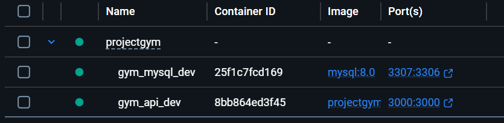
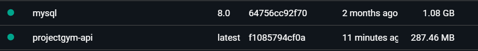
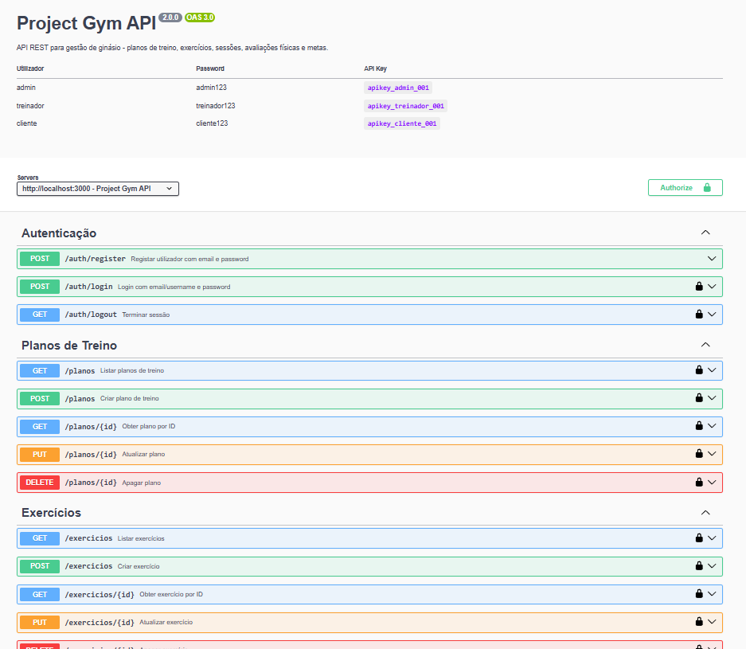
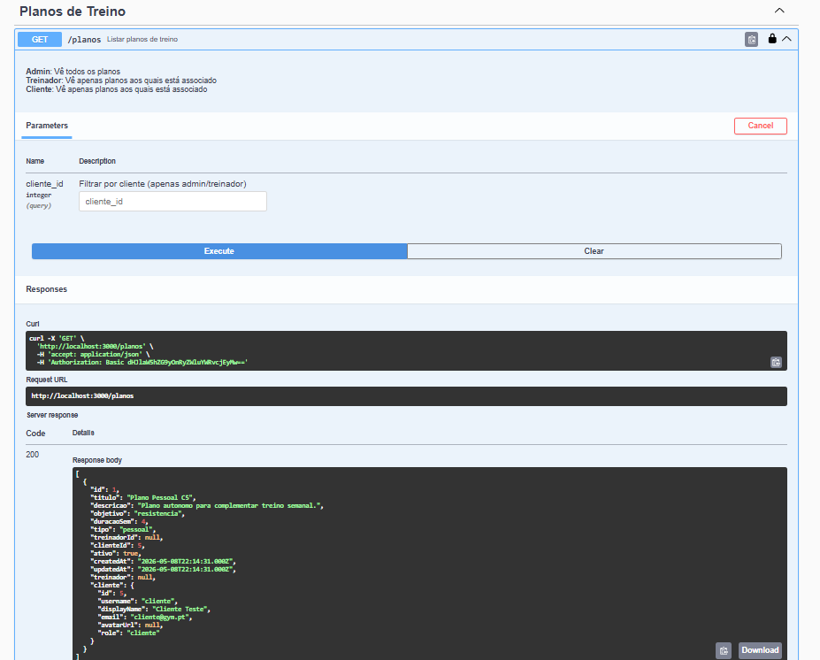
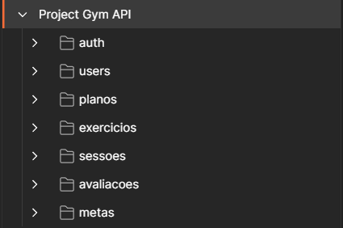
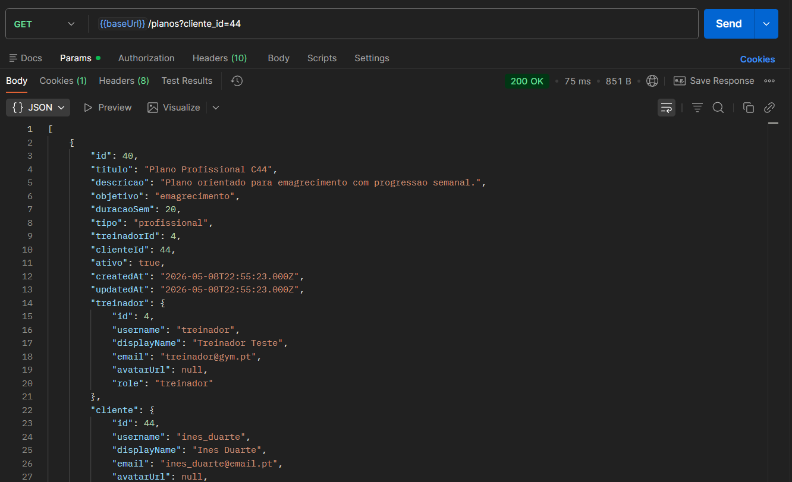

# Project Gym

Repositório do projeto desenvolvido para a a unidade curricular **Desenvolvimento Web II**, do curso de Informática da UMAIA.  

Desenvolvido pelo Grupo 10 - inf26dw2g10

* [Marta Vieira](https://github.com/xmarta19) - a046756@umaia.pt
* [Felipe Castilho](https://github.com/a047152) - a047152@umaia.pt
* [Juliana Moreira](https://github.com/julianaam13) - a047188@umaia.pt

Organização **GitHub**: [inf25dw2g10](https://github.com/inf25dw2g10/ProjectGym)  
Repositório do **DockerHub**: [inf25dw2g10](https://hub.docker.com/repositories/inf25dw2g10)

## Descrição do tema
Uma API REST para a gestão de **treinadores** e **clientes** num ginásio. A plataforma permite que os **treinadores** possam criar planos de treino personalizados, definir exercícios, acompanhar sessões, registar avaliações físicas e monitorar metas dos seus **clientes**, sendo que estes conseguem também ter acesso aos seus recursos. Os **admin** têm permissão para alterar os recursos sem qualquer restrição.

A autenticação suporta três métodos:   
- **Basic Auth** (username/email + password com devolução de `apiKey`);  
- **X-API-Key** (header `X-API-Key` em todos os pedidos);  
- **OAuth2** (GitHub e Google via browser). 

A autorização é baseada em perfis (`admin`, `treinador`, `cliente`).  

## Regras de Autorização

- **Admin**: pode executar operações em todos os recursos, desde que respeitem validações de dados.
- **Treinador**: atua apenas sobre clientes e recursos associados ao seu `id`; não pode operar sobre recursos de outros treinadores.
- **Cliente**: atua apenas sobre recursos do próprio `id`; não pode aceder/alterar recursos de outros utilizadores.

### Planos de treino

- Existem dois tipos: `pessoal` (cliente) e `profissional` (treinador).
- **Cliente**:
  - pode criar/editar/apagar planos pessoais próprios;
  - não pode associar treinador ao plano pessoal;
  - não pode criar/editar/apagar planos de outros clientes.
- **Treinador**:
  - pode criar/editar/apagar apenas planos profissionais em que é o `treinadorId`;
  - não pode alterar planos pessoais de clientes;
  - não pode operar sobre planos de outro treinador.

### Exercícios

- Todo o exercício pertence a um plano.
- **Cliente**:
  - em plano pessoal próprio: pode criar/editar/apagar;
  - em plano profissional próprio: pode apenas atualizar `series`, `reps`, `pesoKg`, `notas`;
  - não pode alterar exercícios de outros clientes.
- **Treinador**:
  - só pode alterar exercícios em planos profissionais dos quais é o treinador responsável;
  - não pode alterar exercícios de planos de outros treinadores/clientes.

### Sessões

- Sessões pertencem a plano e representam aulas com treinador.
- **Criação**: apenas `admin` e `treinador`.
- **Cliente**:
  - não pode criar nem apagar sessões;
  - só pode editar `notas` em sessão própria.
- **Treinador**:
  - cria/edita/apaga sessões em que é o treinador responsável.

### Avaliações físicas

- Existem dois tipos de avaliações: `pessoal` (cliente) e `profissional` (treinador/admin).
- **Cliente**:
  - pode consultar avaliações próprias;
  - pode criar/editar/apagar apenas avaliações **pessoais** próprias;
  - não pode editar/apagar avaliações **profissionais**.
- **Treinador**:
  - cria avaliações **profissionais** para clientes permitidos (no seu âmbito);
  - edita/apaga apenas avaliações **profissionais** por si criadas (no seu âmbito).
- **Admin**:
  - acesso completo (respeitando validações de dados).

### Metas

- Metas estão sempre ligadas a um plano (`planoId` obrigatório).
- **Cliente**:
  - cria metas apenas com `planoId` de plano **pessoal** próprio;
  - pode editar/apagar metas apenas de plano **pessoal** próprio.
- **Treinador**:
  - cria/edita/apaga metas apenas em planos **profissionais** do seu âmbito.
- **Admin**:
  - acesso completo (respeitando validações de dados).

### Utilizadores

- **Cliente**:
  - sem acesso a `GET /users` e `PUT /users/{id}/role`;
  - acesso a `GET /users/me` e `POST /users/me/api-key`.
- **Treinador**:
  - `GET /users` devolve clientes do seu âmbito e também clientes sem plano profissional associado a treinador;
  - sem acesso a `PUT /users/{id}/role`.
- **Admin**:
  - acesso completo aos endpoints de utilizadores.

## Testes automáticos de autorização

Existe um script dedicado para validar regras de autorização por role e por recurso:

- Script: `scripts/roleRulesCheck.js`
- Execução: `npm run test:roles`
  
O script:

- autentica `admin`, `treinador` e `cliente`;
- cobre cenários positivos e negativos por recurso;
- reporta `pass`, `fail` e `skip`.

## Organização do repositório

* Relatório: [doc](doc/)
* Código Fonte: [src](src/)
* Documentação OpenAPI: [openapi.yaml](openapi.yaml)
* Coleção do Postman:  [gym-api.postman_collection.json](gym-api.postman_collection.json)
* Páginas HTML: [public](public/)
* Configuração do Sequelize: [config](config/)
* Modelos do Sequelize: [models](models/)
* Migrations da BD: [migrations](migrations/)
* Dados da BD: [seeders](seeders/)
* Script de teste: [scripts](scripts/)

## Galeria

| Descrição            | Imagem |
|----------------------|--------|
| *DockerHub*: *Containers* |  |
| *DockerHub*: *Images*     |  |
| *Swagger UI*  |  |
| *Swagger UI*: Exemplo |  |
| *Postman*: Recursos     |  |
| *Postman*: Método *GET*   |  |

## Tecnologias

* [Node.js](https://nodejs.org/en/) - Servidor
* [Express](https://expressjs.com/) - Framework Web
* [MySQL 8.0](https://www.mysql.com/) - Base de Dados 
* [Sequelize](https://sequelize.org/) - ORM
* [Passport.js](https://www.passportjs.org/) - Autenticação
* [Docker](https://www.docker.com/) - Containerização

### Frameworks e Bibliotecas

* [passport-github2](https://www.npmjs.com/package/passport-github2) - OAuth2 GitHub
* [passport-google-oauth20](https://www.npmjs.com/package/passport-google-oauth20) - OAuth2 Google
* [passport-local](https://www.npmjs.com/package/passport-local) - Basic Auth
* [bcryptjs](https://www.npmjs.com/package/bcryptjs) - Hash de passwords
* [swagger-ui-express](https://www.npmjs.com/package/swagger-ui-express) - Documentação interativa

## Relatório

#### Apresentação do projeto
* Capítulo 1: [Apresentação do projeto](doc/c1.md)

#### Recursos
* Capítulo 2: [Recursos e Base de Dados](doc/c2.md)

#### Produto
* Capítulo 3: [Autenticação e Autorização](doc/c3.md)

#### Apresentação
* Capítulo 4: [Apresentação do Produto](doc/c4.md)

## Grupo 10 - inf26dw2g10

- a046756@umaia.pt - [Marta Vieira](https://github.com/xmarta19)
- a047152@umaia.pt - [Felipe Castilho](https://github.com/a047152) 
- a047188@umaia.pt - [Juliana Moreira](https://github.com/julianaam13)
