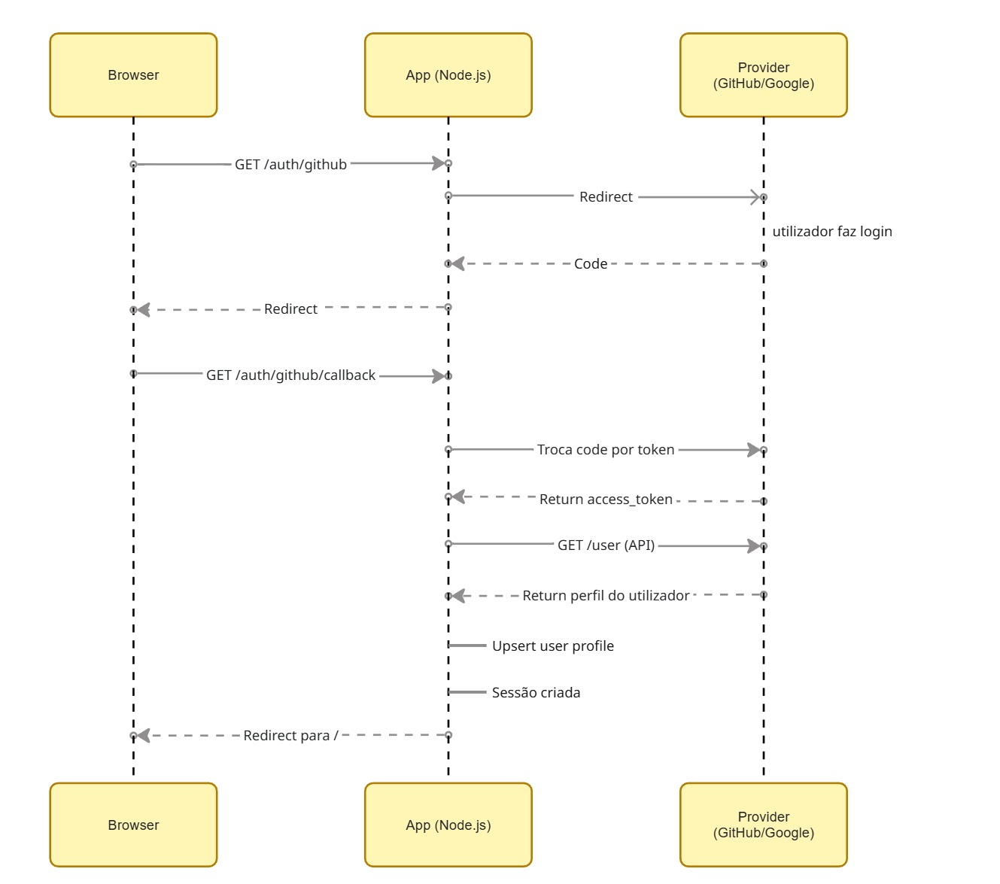
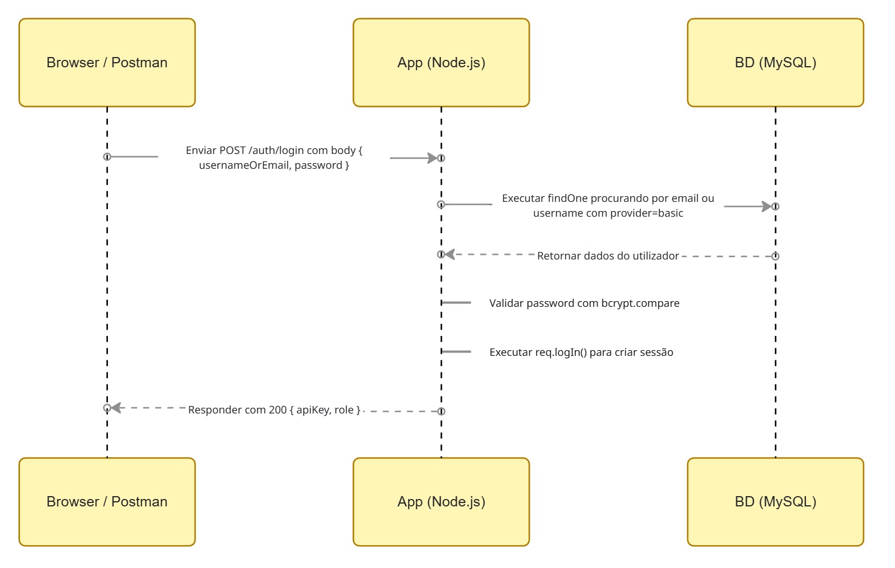

# C3 : Autenticação e Autorização

## Introdução

Neste projeto, foi implementada uma camada de autenticação e autorização para que os endpoints protegidos possam ser acedidos por diferentes métodos de autenticação:  

- **Basic Auth** - *HTTP Basic* no header `Authorization`
- **API Key** - header `X-API-Key`
- **OAuth 2.0** - sessão (`connect.sid`) depois de *login* via *GitHub*/*Google*


---

## OAuth 2.0 

### Authorization Code Flow 

1. A app redireciona o utilizador para o *provider* com `client_id` e `redirect_uri`
2. O utilizador faz *login* no *provider* e autoriza a app
3. O *provider* redireciona para o *callback* com um **authorization code**
4. A app troca esse código por um **access token** (chamada *server-to-server*)
5. A app usa o *token* para obter dados do utilizador

O `access_token` nunca passa pelo *browser* - só circula entre o servidor da app e o *provider*.

### Como autentica os endpoints protegidos

Após o login OAuth2 (GitHub/Google), o servidor cria uma sessão com `express-session` e o browser passa a enviar automaticamente o cookie `connect.sid`. 
Nos endpoints protegidos, o middleware valida `req.isAuthenticated()`.


## Implementação no Projeto

### Fluxo OAuth2 (GitHub e Google)




## API Key (X-API-Key)

### Como funciona

1. O cliente envia a key no header `X-API-Key`.
2. O servidor procura o utilizador na base de dados (`Utilizador.findOne({ where: { apiKey } })`).
3. Se existir, `req.user` é preenchido e o pedido prossegue.

### Como obter a API key

- No registo/login local, a resposta devolve a `apiKey`.
- A key também pode ser regenerada em `POST /users/me/api-key`.


## Basic Auth 

### Login local (criação de sessão)

O projeto inclui `POST /auth/login` (estratégia `passport-local`) para permitir *login* via *browser*/*Postman* e criar sessão.

**Criação de sessão no controller:**

```javascript
// src/controllers/authController.js
function login(req, res, next) {
  // Usa a strategy local já configurada no passport.
  passport.authenticate('local', (err, user, info) => {
    if (err) return next(err);
    if (!user) return res.status(401).json({ erro: info?.message || 'Credenciais inválidas.' });

    req.logIn(user, (err2) => {
      if (err2) return next(err2);
      return res.status(200).json({
        mensagem: 'Login efetuado com sucesso.',
        id: user.id,
        role: user.role,
        apiKey: user.apiKey
      });
    });
  })(req, res, next);
}
```

### Autenticação por pedido 



- A autenticação *HTTP Basic* **por pedido**  valida apenas pelo `username` (não o email).  
- No endpoint `POST /auth/login`, o *login local* aceita `username` **ou** `email` (via `passport-local`).

### Utilização de `bcrypt` 

- A password **nunca é guardada em texto**.
- No registo (`POST /auth/register`), o servidor calcula `passwordHash = bcrypt.hash(password, 12)` e guarda **apenas** `passwordHash`.
- Na autenticação (login local ou HTTP Basic), o servidor usa `bcrypt.compare(password, passwordHash)` para validar.
- O número `12` é o *cost factor*: aumenta o custo computacional do hash e dificulta ataques de força bruta.

```javascript
// src/controllers/authController.js
const passwordHash = await bcrypt.hash(password, 12);
const apiKey = gerarApiKey();
const providerId = `basic_${Date.now()}_${Math.random().toString(36).slice(2)}`;

const user = await Utilizador.create({
  providerId,
  provider: 'basic',
  username: username.trim(),
  displayName: displayName || null,
  email,
  passwordHash,
  apiKey,
  role: 'cliente'
});
```

**Login local - `bcrypt.compare` na estratégia `passport-local`:**

```javascript
// src/controllers/authController.js
const valida = await bcrypt.compare(password, user.passwordHash);
if (!valida) return done(null, false, { message: 'Email ou password incorretos.' });
```

**HTTP Basic por pedido - `bcrypt.compare` no middleware:**

```javascript
// src/middleware/auth.js
const ok = await bcrypt.compare(credentials.pass, user.passwordHash);
if (!ok) {
  res.set('WWW-Authenticate', 'Basic realm="Authorization Required"');
  return res.sendStatus(401);
}
```

---

## Autorização por Roles

Após autenticação, a autorização é feita com base no campo `role` do utilizador (`admin`, `treinador`, `cliente`).

```js
// src/middleware/auth.js
function ensureRole(...roles) {
  return (req, res, next) => {
    if (!req.user || !roles.includes(req.user.role)) {
      return res.status(403).json({ erro: `Acesso negado. Requer role: ${roles.join(' ou ')}.` });
    }
    next();
  };
}
```

### Tabela de permissões 


- **próprio**: recurso associado ao utilizador autenticado (ex.: `clienteId = req.user.id`)
- **só os seus** (treinador): planos/sessões onde `treinadorId = req.user.id`, ou recursos de clientes que têm pelo menos um plano com esse treinador (leque de clientes)

### Regras implementadas 

#### Autenticação 
- **Sessão/cookie**: quando há sessão autenticada (`req.isAuthenticated()`), o pedido é aceite.
- **API key**: header `X-API-Key` identifica o utilizador e preenche `req.user`.
- **HTTP Basic**: header `Authorization: Basic ...` autentica por pedido.


#### Regras gerais por role
- **Cliente**: só vê e altera recursos do próprio (por `clienteId = req.user.id`).
- **Treinador**: só atua no seu âmbito:
  - planos profissionais onde `treinadorId = req.user.id` e recursos associados a esses planos/clientes;
  - em listagens (`/users`, filtros), também consegue ver clientes **sem qualquer plano profissional com treinador** (clientes “livres”).
- **Admin**: acesso total, respeitando validações de dados.

#### Planos
- Existem 2 tipos: **pessoal** (cliente; `treinadorId=null`) e **profissional** (treinador/admin; `treinadorId` preenchido).
- Cliente:
  - cria/edita/apaga apenas **plano pessoal próprio**;
  - **não edita** plano profissional.
- Treinador:
  - cria/edita/apaga apenas **planos profissionais próprios**;
  - não mexe em planos pessoais;
  - não consegue criar plano profissional para cliente já associado a outro treinador.

#### Exercícios
- Exercícios pertencem sempre a um plano.
- Cliente:
  - em **plano pessoal**: pode criar/editar/apagar;
  - em **plano profissional**: pode apenas editar **`series`, `reps`, `pesoKg`, `notas`** (não cria nem apaga).
- Treinador: CRUD apenas em exercícios de **planos profissionais** em que é responsável.

#### Sessões
- Sessões **só podem existir em planos profissionais**.
- Cliente: não cria nem apaga; em sessão própria só atualiza **`notas`**.
- Treinador: cria/apaga (rota bloqueia cliente) e só atua em sessões do seu âmbito.

#### Avaliações físicas
- Existem 2 tipos: **pessoal** (cliente; `treinadorId=null`) e **profissional** (treinador/admin; `treinadorId` do criador).
- Cliente: cria/edita/apaga apenas avaliações **pessoais próprias**.
- Treinador: cria/edita/apaga avaliações **profissionais** no seu âmbito e (para editar/apagar) apenas as profissionais **criadas por si**.

#### Metas
- Meta pertence sempre a um plano (`planoId` é obrigatório no código).
- Cliente: cria/edita/apaga apenas metas ligadas a **planos pessoais próprios**.
- Treinador: cria/edita/apaga apenas metas ligadas a **planos profissionais** dos seus clientes.

### Autorização 
As rotas (`src/routes/`) só garantem **autenticação** (`ensureAnyAuth`) e, um **role mínimo** (`ensureRole`).  
As restantes regras são aplicadas  nos **controllers** (`src/controllers/*`).

**Exemplos:**  

Na criação de exercícios - o cliente só pode criar em exercicios num plano pessoal e o treinador só  pode criar exercicios nos seus planos.
```javascript
// src/controllers/exerciciosController.js
if (req.user.role === 'cliente') {
  if (plano.clienteId !== req.user.id) {
    return res.status(403).json({ erro: 'Cliente só pode criar exercícios nos seus próprios planos.' });
  }
  if (plano.tipo !== 'pessoal') {
    return res.status(403).json({ erro: 'Cliente só pode criar exercícios em planos pessoais.' });
  }
} else if (req.user.role === 'treinador') {
  if (plano.treinadorId !== req.user.id) {
    return res.status(403).json({ erro: 'Treinador só pode criar exercícios nos seus próprios planos.' });
  }
}
```
Na atualização de um exercício em um plano profissional - o cliente com campos restritos (series, reps, pesoKg, notas).

```javascript
// src/controllers/exerciciosController.js
if (exercicio.plano.tipo === 'pessoal') {
  // ...
} else {
  const tentouEditarCampoNaoPermitido =
    nome !== undefined ||
    grupoMuscular !== undefined ||
    ordem !== undefined;
  if (tentouEditarCampoNaoPermitido) {
    return res.status(403).json({ erro: 'Em plano profissional, cliente só pode alterar series, reps, pesoKg e notas.' });
  }
  // ...
}
```

---

## Log na Consola 

**A cada pedido autenticado** (`ensureAnyAuth`):
```
┌─────────────────────────────────────────────
│ Utilizador Autenticado
│  ID       : 2
│  Username : joao_fitness
│  Nome     : João Ferreira
│  Email    : joao@email.pt
│  Provider : github
│  Role     : treinador
│  Rota     : GET /planos
│  Data/Hora: 2026-04-30T10:30:00.000Z
└─────────────────────────────────────────────
```

**No login Basic Auth:**
```
┌─────────────────────────────────────────────
│ Basic Auth Login
│  Username : joao_fitness
│  Email    : joao@email.pt
└─────────────────────────────────────────────
```

**No registo de novo utilizador** (`POST /auth/register`):
```
┌─────────────────────────────────────────────
│ Novo Utilizador Registado
│  Username : novo_user
│  Email    : novo@gym.pt
└─────────────────────────────────────────────
```

**No login OAuth2** (GitHub e Google):
```
┌─────────────────────────────────────────────
│ OAuth 2 Login
│  Provider : github
│  Username : joao_fitness
└─────────────────────────────────────────────
```

**No login por API Key** (`POST /auth/login` com header `X-API-Key`):
```
┌─────────────────────────────────────────────
│ API Key Login
│  ID       : 1
│  Username : admin
│  Email    : admin@gym.pt
│  Role     : admin
└─────────────────────────────────────────────
```

**No logout** (`GET /auth/logout`):
```
┌─────────────────────────────────────────────
│ Logout
│  User ID  : 2
│  Username : joao_fitness
│  Email    : joao@email.pt
└─────────────────────────────────────────────
```

---

## Testar automaticamente as autorizações

- **Script de testes de autorização (roles)**: `scripts/roleRulesCheck.js`
- Execução (com a API a correr):

```bash
npm run test:roles
```

---


[< Anterior](c2.md) | [^ Início](../README.md) | [Próximo >](c4.md)
:--- | :---: | ---:
