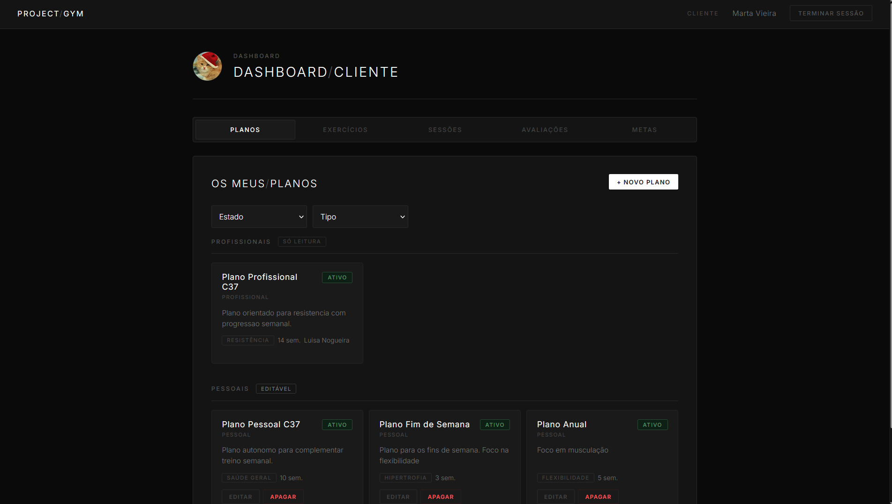
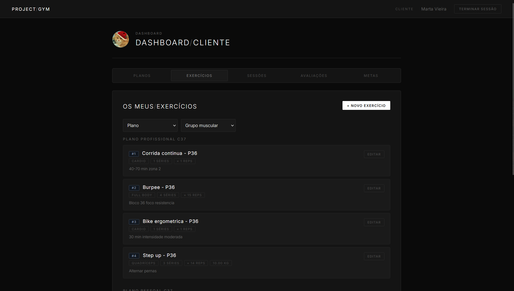
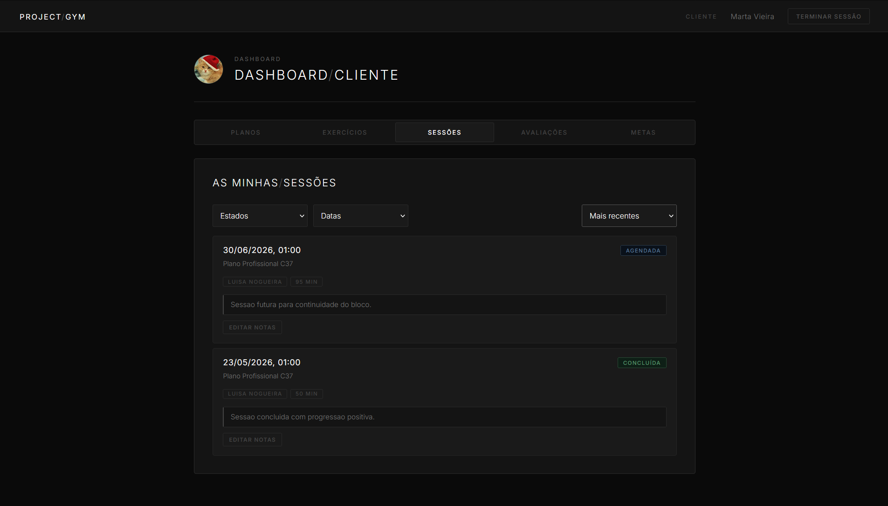
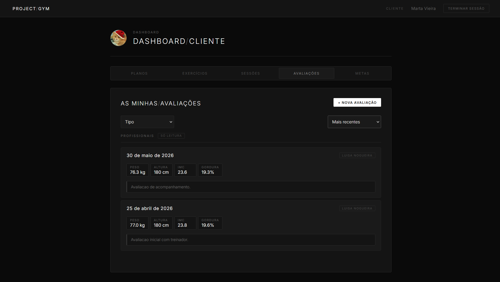
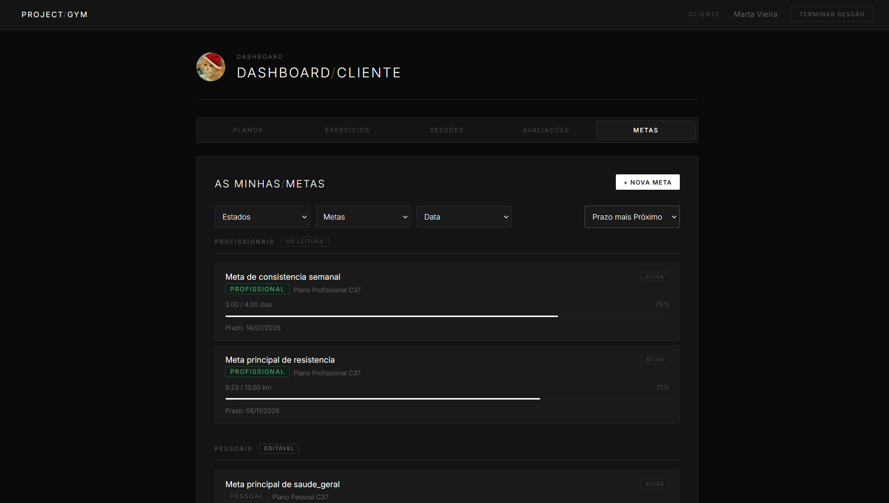
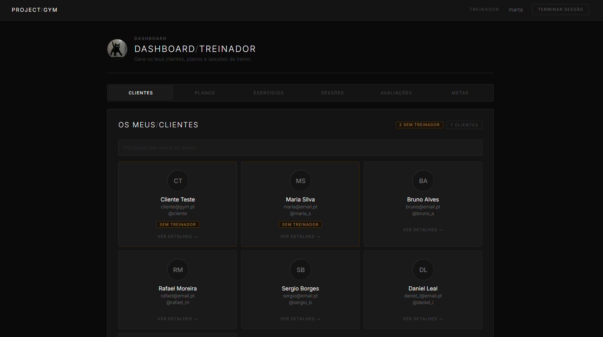
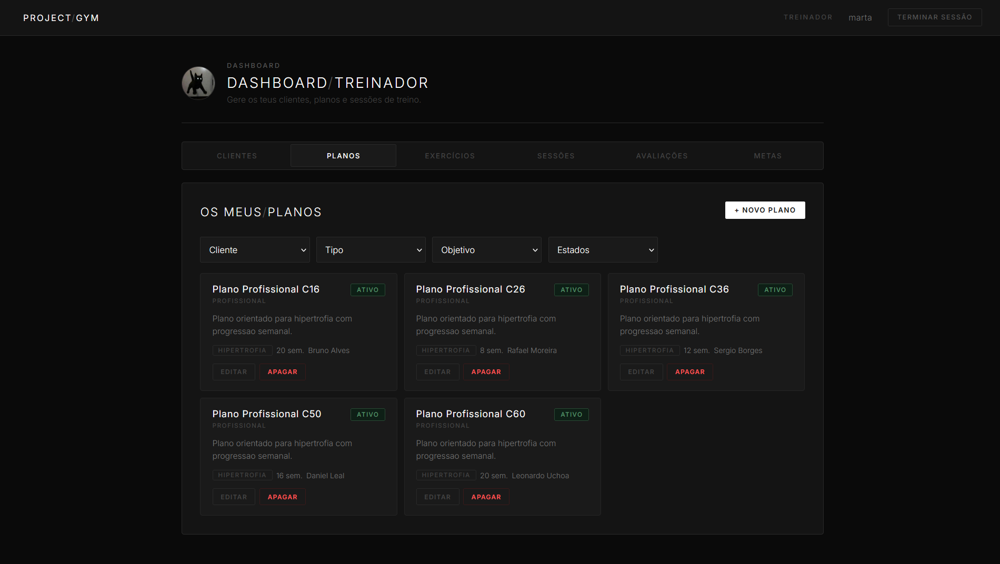
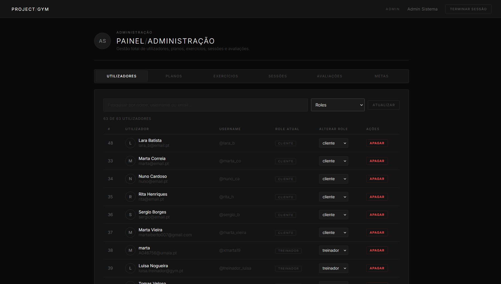
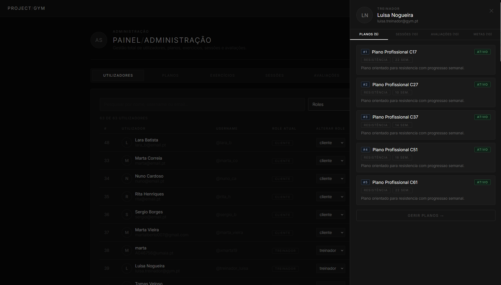

# C1 : Apresentação do Projeto (Frontend React)

## Descrição

Este trabalho consiste no **frontend React** da plataforma de gestão de ginásio. Permite que **admin**, **treinadores** e **clientes** consultem e gerem recursos consoante a sua role:

- Planos de treino, exercícios, sessões, avaliações físicas e metas
- Gestão de utilizadores *(apenas admin)*

O browser comunica com a **GymAPI** (REST) através de pedidos HTTP autenticados (`X-API-Key`), após login por **Basic Auth** ou **OAuth 2.0** (GitHub / Google).

**Autenticação**

- **Basic Auth** - `POST /auth/login` com username/email + password → devolve `apiKey` e `role`
- **X-API-Key** - header enviado em todos os pedidos à API
- **OAuth 2.0** - redirect para `/auth/github` ou `/auth/google` → callback no frontend

**Regras de autorização**

- **Admin** - opera em todos os recursos (reutiliza as páginas do treinador no dashboard)
- **Treinador** - atua sobre clientes e recursos do seu âmbito
- **Cliente** - atua apenas sobre os próprios recursos; planos profissionais são só leitura (com excepções por recurso)

---

## Arquitetura

A solução corre em **Docker** com três serviços:

| Serviço | Tecnologia | Porta (host) |
|---------|------------|--------------|
| Frontend | React 18 + CRA *(dev)* / nginx *(prod)* | **8080** |
| API | Node.js + Express + MySQL | **3000** (interno) |
| Base de dados | MySQL 8.0 | **3307** |

O browser acede apenas ao frontend (`http://localhost:8080`).

| Camada | Tecnologia |
|--------|------------|
| Frontend | React 18 + Create React App (`react-scripts`) |
| Routing | React Router v5 |
| HTTP | Axios |
| API | Node.js + Express + Sequelize *(pasta `api/`)* |
| Docker prod | nginx (build estático) + API + MySQL |
| Docker dev | CRA dev server + nodemon + MySQL |

**Produção** - o nginx serve a SPA React e faz **proxy** dos pedidos `/auth`, `/planos`, `/exercicios`, etc. para o container da API.

**Desenvolvimento** - o proxy está em `src/setupProxy.js`; o CRA dev server reencaminha para a API.

Documentação técnica da API: [`api/README.md`](../api/README.md).

---

## Instalação

### Pré-requisitos

- Docker e Docker Compose instalados
- Portas **8080** e **3307** disponíveis

Na raiz do projecto:

```bash
cp .env.example .env
```

Editar `.env` com credenciais OAuth se quiseres usar GitHub/Google.

### Produção

Recomendado para entrega e apresentação.

```bash
docker compose -f docker-compose.prod.yml up --build
# ou: docker compose up --build
```

Abre **http://localhost:8080**

### Desenvolvimento

Hot reload no React + nodemon na API.

```bash
docker compose -f docker-compose.dev.yml up --build
```

**OAuth (GitHub/Google):**   
Os callbacks devem apontar para `http://localhost:8080/auth/github/callback` e  `http://localhost:8080/auth/google/callback` respetivamente.

---

## Uso

### Credenciais de teste

| Role | Username | Password |
|------|----------|----------|
| Admin | `admin` | `admin123` |
| Treinador | `treinador` | `treinador123` |
| Cliente | `cliente` | `cliente123` |

### Fluxo de login

1. Abrir `http://localhost:8080/login`
2. Autenticar com username/password ou OAuth (GitHub / Google)
3. A aplicação guarda `apiKey` e `role` no `localStorage`
4. Redireccionamento automático para `/admin`, `/trainer` ou `/client`

## Dashboard do Cliente

### Planos
  

### Exercícios
  

### Sessões
  

### Avaliações
  

### Metas


## Dashboard do Treinador





## Dashboard do Admin




---

[^ Início](../README.md) | [Próximo >](c2.md)
:---: | ---:
